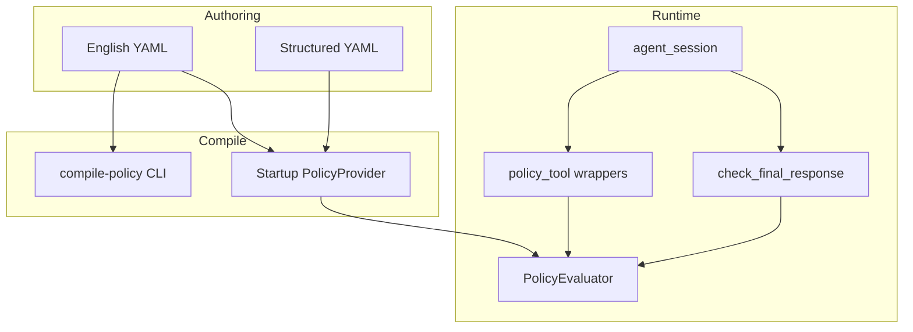

# Agentic loan desk example

End-to-end demo of **English policies compiled and enforced** at both **tool** and **agent** scope. Scenarios are scripted in `demo.py` and need no LLM (rule-based compiler); `ai_demo.py` runs the same flow through the AI compiler.

For a minimal tool-only introduction, see [loan_approval_basic](../loan_approval_basic/).

## Prerequisites

From the repository root:

```bash
pip install -e ".[dev]"
```

## Policy ladder

| Tier | Scope | File | What it proves |
|------|-------|------|----------------|
| Easy | Tool | `policies/01_tool_high_value_english.yaml` | English compiles via inventory; blocks large **auto** approvals |
| Easy (ref) | Tool | `policies/01_tool_high_value_structured.yaml` | Same rule in structured form (disabled) |
| Medium | Agent + tool | `policies/02_agent_only_loan_agent_english.yaml` | Only `loan-agent` may call `approve_loan` |
| Medium+ | Agent workflow | `policies/03_workflow_human_review.yaml` | Large approvals need `metadata.human_reviewed: true` |
| Medium | Agent output | `policies/04_agent_safe_response.yaml` | Blocks unsafe guarantee language before the response is sent |

## English → enforceable policy

Inspect compilation without running the app:

```bash
cd examples/agentic_loan_desk
openagentpolicy compile-policy policies/01_tool_high_value_english.yaml --inventory inventory.yaml
openagentpolicy compile-policy policies/02_agent_only_loan_agent_english.yaml --inventory inventory.yaml
```

At runtime, enabled English policies are compiled in memory when `configure()` loads config (`support_english: true`, `compile_on_startup: true`). Only **compiled** structured policies are enforced.

## Run the demo

```bash
cd examples/agentic_loan_desk
python demo.py
```

You should see:

1. **Phase 1** — compiled triggers/conditions for English policies  
2. **Scenarios A–E** — labeled `ALLOWED` / `BLOCKED` with policy messages  
3. **Traces** — `openagentpolicy_traces/events.jsonl` audit log  

## Run the demo with the AI compiler

`demo.py` uses the deterministic rule-based compiler (no network). To compile the
English policies with an LLM instead, use `ai_demo.py` + `openagentpolicy.ai.yaml`
(which sets `policies.english_compiler: ai`):

```bash
pip install openai
export OPENAI_API_KEY=sk-...
cd examples/agentic_loan_desk
python ai_demo.py
```

The LLM only runs at runtime load (`configure()`), and AI output is enforced
**only when the rule-based compiler independently produces an equivalent policy**
(deterministic corroboration). Without a key (or when the AI output is not
corroborated), the affected English policies become `needs_review` and are **not
enforced** — `ai_demo.py` prints exactly which policies were loaded so this is
visible. To inspect the runtime's compiled set directly:

```bash
openagentpolicy explain --config openagentpolicy.ai.yaml --format json
```

> Note: the CLI `compile-policy` / `compile-english` commands always use the
> rule-based compiler; the `ai` mode path is exercised through runtime load only.

## How agents are modeled

`agent_session.py` wraps `openagentpolicy.agent_session` so each tool call carries:

- `agent_id` — which agent is acting (`loan-agent` vs `compliance-agent`)
- `metadata` — session flags such as `human_reviewed`

`finalize_response()` runs `before_final_response` policies on agent text.

## Architecture



## Files

| File | Purpose |
|------|---------|
| `openagentpolicy.yaml` | Runtime config, policy directory, traces |
| `openagentpolicy.ai.yaml` | Same config with `english_compiler: ai` for `ai_demo.py` |
| `inventory.yaml` | Agents, tools, argument aliases for the compiler |
| `policies/` | Tiered policies (English + structured) |
| `tools.py` | `@policy_tool` definitions |
| `agent_session.py` | Agent context helpers |
| `demo.py` | Scripted scenarios (rule-based compiler) |
| `ai_demo.py` | Scripted scenarios using the AI compiler (`openagentpolicy.ai.yaml`) |
